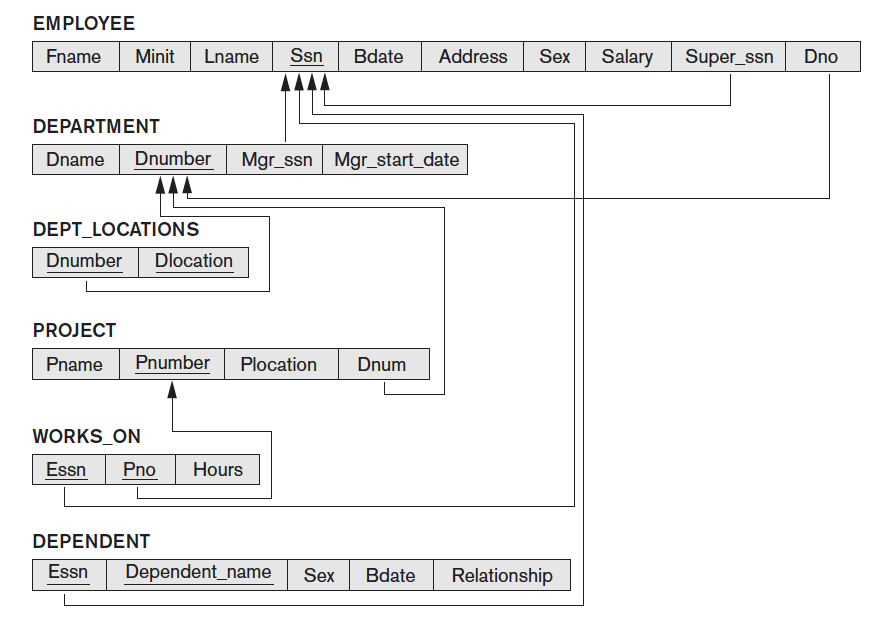
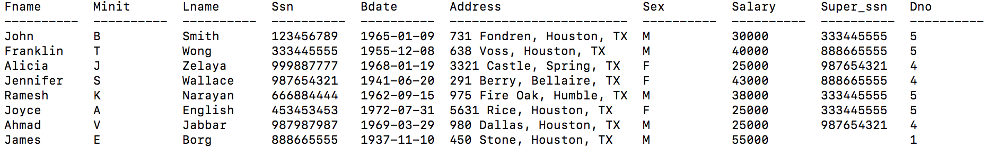
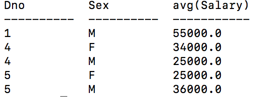
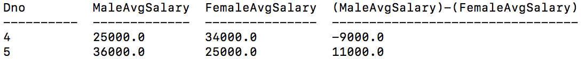
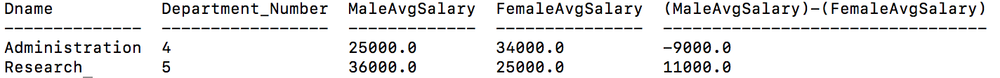

# Example Queries
1) Get average salary of every employee who has a supervisor who is 3 years older than them.  
2) Get the average number of hours worked on projects with at least 2 employees working on them. 
3) Get the name and address of all employees who have a supervisor dependent born after 1970. 
4) Find the department with the largest difference in salary between male and female employees. 
5) For every employee who is working on two or more projects and is not a manager, get the full name of their manager. 
6) Get the name of the department for every project that has exactly two people working on it. 

# Introduction

# SQL Select and Join Review

# Company Database Examples
To better illustrate the utility of using join and select operation in SQL to formulate complex queries, we will walk through an example. This example is taken from the COMPANY database referenced in the course textbook. The COMPANY database contains tables detailing data about employees, departments, projects, and employee dependents, etc. A snapshot of the relational schema is shown below in Figure 1. For a detailed description of the COMPANY database, please refer to chapter 2 of the textbook.

Figure 1: COMPANY relational schema [Taken from the course textbook]

One question that might arise for a data analyst with access to such database might be: what department in the company has the highest salary gap between male and female workers? To find the answer to this question, we need to able to use nested select statements, UNION operations and aggregation operations.

As a first step, we will load the Employee table using the following SQL command:

> select * from Employee;

This produces the following table:

Now, we would like to summarize the salary data in this table, so that we have the average salary for males and females of every department. To accomplish this, we use the group by operation at the end of select statements to pick the criteria by which we indent to aggregate the data. Furthermore, we use avg() to average the salaries. The following SQL line can be used to obtain the average salary for each department,sex pair.

> select Dno,Sex,avg(Salary) from Employee group by Dno,Sex;

At this point, we need to combine male and female data for each department and compare their earnings(note that this will exclude Depratment 1 which has only one employee). To do this, we need to retrieve the male and female table separately:
> select Dno,Sex,avg(Salary) from Employee where Sex = 'M' group by Dno,Sex ;

> select Dno,Sex,avg(Salary) from Employee where Sex = 'F' group by Dno,Sex ;

This is where the JOIN operations are useful. We can attach these two tables side by side, so that each column contain the female and male salaries for a certain department. We will join the two tables on a common attribute they have, which is Dno. Lastly, we can select the difference (using the - operator) between any two attributes in a table. Thus, we will calculate the different between the male and female salaries from the table as follows:

> select DnoMale as Dno,MaleAvgSalary,FemaleAvgSalary, (MaleAvgSalary)-(FemaleAvgSalary) from
(select Dno as DnoMale,Sex,avg(Salary) as MaleAvgSalary from Employee where Sex = 'M' group by Dno,Sex),
(select Dno as DnoFemale,Sex,avg(Salary) as FemaleAvgSalary from Employee where Sex = 'F' group by Dno,Sex) on DnoMale = DnoFemale ;

It would be helpful now to have the name of the department shown in the table. The best way to do this is to join the last table with the department table on the Dno attribute

Finally, we need a command that will only return the highest difference between male and female workers. To achieve this, we only need to use the max command on the difference between salaries in the select statement:

> select Dname,DnoMale as Department_Number,MaleAvgSalary,FemaleAvgSalary, max(MaleAvgSalary)-(FemaleAvgSalary) from
Department
,
(select DnoMale,MaleAvgSalary,FemaleAvgSalary, (MaleAvgSalary)-(FemaleAvgSalary) from
(select Dno as DnoMale,Sex,avg(Salary) as MaleAvgSalary from Employee where Sex = 'M' group by Dno,Sex),
(select Dno as DnoFemale,Sex,avg(Salary) as FemaleAvgSalary from Employee where Sex = 'F' group by Dno,Sex) on DnoMale = DnoFemale )
on Dnumber = DnoMale;
